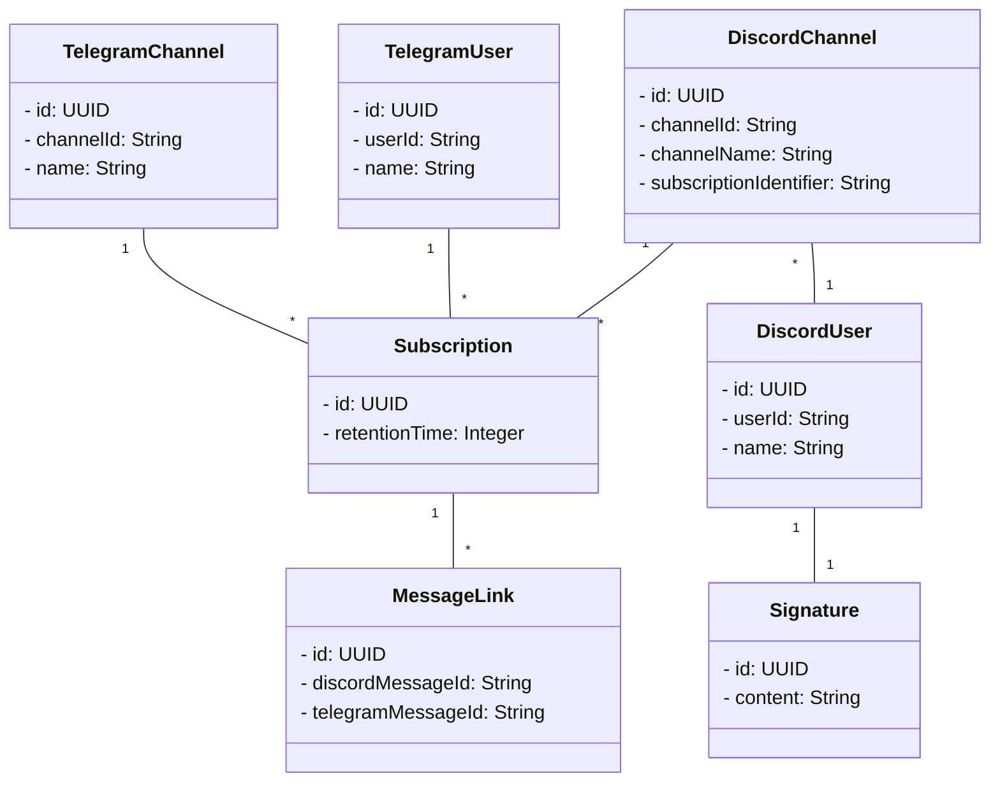

# DisGram
## Model

## Schritt für Schritt Anleitung
Der Bot wird bereits im Internet gehostet und mit folgender Schritt für Schritt Anleitung kann man ihn nutzen, um Discord
Kanäle in Telegram Kanälen zu abonnieren. Der Bot ist jeweils mit einem Discord-Registrierungstoken und einem Telegram-Registrierungstoken 
geschützt und ohne diese Token man ihn nicht nutzen, aber jedem steht es frei den Bot selbst zu hosten.

### Discord
Mit den folgenden fünf Schritten machst du deinen Discord-Kanal für Telegram Kanäle abonnierbar. Alle Schritte in diesem Abschnitt betreffen ausschließlich Discord!

1. Füge den Bot deinem Discord Server hinzu indem du auf [diesen Link](https://discordapp.com/oauth2/authorize?&client_id=1011564192182046780&scope=bot&permissions=2147486720) klickst und den Anweisungen folgst.
2. Geh auf deinen Discord Server in irgendeinen Discord Kanal oder starte einen privaten Chat mit dem DisGram Bot auf Discord und registriere deinen Discord User mit dem Befehl `/disgram register token <Registrierungstoken>`. Dieser Schritt muss nur beim ersten Mal ausgeführt werden!
3. Mache deinen Discordkanal abonnierbar indem du den Befehl `/disgram set id <identifier>` eingibst. Der Identifier wird verwendet, um auf Telegramseite diesen Kanal abonnieren zu können. Es ist optional den Identifier zu setzen. Setzt man keinen expliziten Identifier wird automatisch der Kanalname als Identifier verwendet. Es wird empfohlen den Identifier nicht zu setzen und ihn nur zu verwenden, wenn es zu Namenskonflikten kommen kann.
4. Wird in einem abonnierbarem Discord Kanal der Befehl `/discord unset` eingegeben, wird die Abonnierbarkeit wieder aufgehoben
5. Optional: Du kannst den Discord Nachrichten eine Signatur hinzufügen, die auf Telegram angezeigt werden soll. Die Änderung der Signatur erfolgt über den Befehl `/disgram signature` und die Signatur muss in Markdownformat eingegeben werden. in Beispiel für Links sähe so aus \[google](google.de).

### Telegram
Mit den folgenden vier Schritten abooniert dein Telegram Kanal einen Discord Kanal. Alle Schritte in diesem Abschnitt betreffen ausschließlich Telegram!

1. Füge [diesen Bot](https://t.me/DisGram_die_sache_bot) deinem Telegram Kanal hinzu.
2. Starte einen privaten Chat mit dem Telegram Bot und gebe den Befehl `/register` ein und folge der Anweisung, um deinen Telegram User zu registrieren. Dieser Schritt muss nur beim ersten Mal ausgeführt werden!
3. Leite aus dem Telegram Kanal, der einen Discord Kanal abonnieren soll eine Nachricht an den DisGram Bot auf Telegram weiter, um ein Abonnement zu einem Discord Kanal herzustellen. Folge dabei den Anweisungen.
4. Eine Subscription wird in einem privaten Chat mit dem DisGram Bot auf Telegram durch den Befehl `/unsubscribe` wieder aufgehoben. Folge dabei den Anweisungen.
